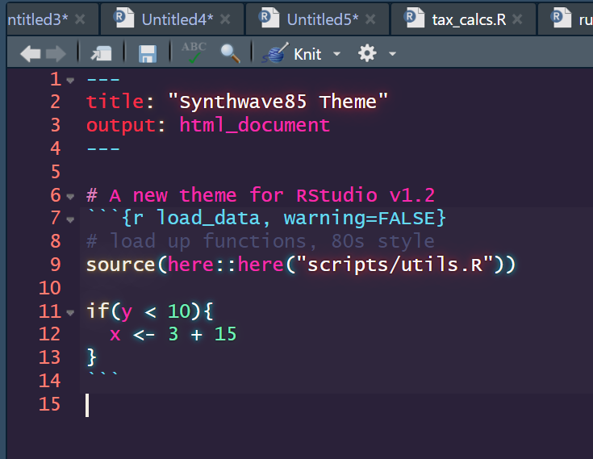

# Synthwave85
_An interpretation of Synthwave84 for RStudio v1.2+_

This is an artistic interpretation of the amazing [Synthwave84 theme for Visual Studio Code](https://github.com/robb0wen/synthwave-vscode) by Robb Owen. RStudio version 1.2 allows for custom themes, and this is an attempt at taking that too its most logical 80s conclusion.

## Installation

  1. Ensure you have the latest version of RStudio (at least v1.2, which was [released in April of 2019](https://blog.rstudio.com/2019/04/30/rstudio-1-2-release/))
  2. Run this one line of R code! `rstudioapi::addTheme("https://raw.githubusercontent.com/jnolis/synthwave85/master/Synthwave85.rstheme", TRUE, TRUE, FALSE)`

## Issues

This is more for fun than for practical use: while the glow of code was critical in the 1980s, it unfortunately seems that the cool aesthetic causes the editor to go slowly on larger files.

Editing a theme is kind of a hunt to see if you've made all the necessary changes from your starting template. If there is something that seems wildly out of style in the theme, please raise a GitHub issue!

## Uninstallation / Change Theme

### Change Theme

To change your current theme, You can select your desired Theme by going to `Tools > Global Options > Appearance > Editor theme`

### Uninstallation

To uninstall **Synthwave85** (removing it from the list of available Themes), Execute the following code:

`rstudioapi::removeTheme("Synthwave85")`
